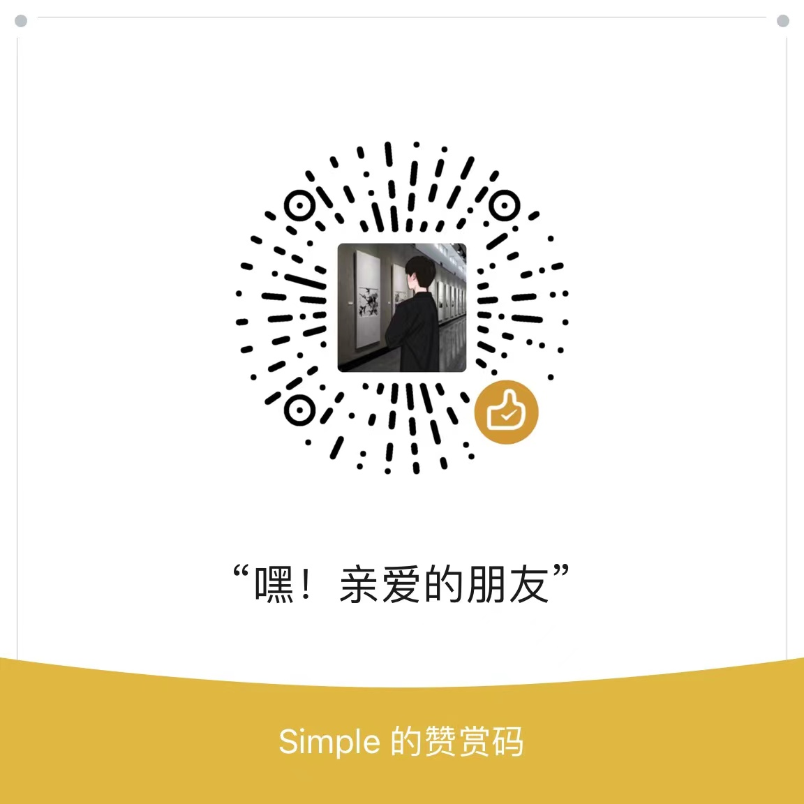

# 垃圾分类小程序部署步骤 

### 1.**[创建微信小程序](https://mp.weixin.qq.com/)**

### 2.**[注册百度智能云并实名认证, 创建一个图像识别应用, 记录应用API KEY 和 SECRET KEY, 创建资源之后记得领取免费资源](https://console.bce.baidu.com/ai/?_=&fromai=1#/ai/imagerecognition/app/create)**

### 3.**使用微信开发者工具创建一个云开发环境, 并复制环境ID**

### 4.**进入微信开发者工具导入垃圾分类小程序项目, 注意我这里导入的是包含cloudfunctions,miniprogram,project.config.json的整个文件夹**

### 5.**添加百度API KEY \ SECRET 和 小程序appid, 云环境ID**

### 6. **部署云函数**
* 点击`cloudfuntions`文件夹展开子文件夹
* 依次右键点击展开的子文件夹并点击弹出的`上传并部署(不上传node_modules)`

### 7. **部署云数据库**
* 点击小程序开发工具的`云开发`
* 点击`数据库`
* 创建集合`trash`, `type`
* 依次导入`trash.json`, `type.json`文件

# 至此部署完成!

# 小程序访问体验
<!--  -->
 

### 联系方式
> Vx: yiiyi8

> 邮箱: yii8@foxmail.com

### 打赏(如果需要数据集请联系我)
- 开发不易, 随意打赏

#### 微信

